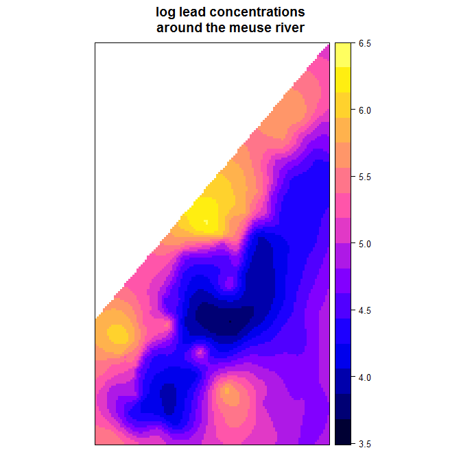

```{r setup, include=FALSE}
knitr::opts_chunk$set(echo = TRUE)
```

## Contents

- Data sources
- A note on syntax
- What is R?
- Why do GIS in R?
- Must-have R packages
- Overview of spatial data types in R
- Reading, writing vector and raster data
- Subsetting vector and raster data
- Map projections 
- Visualising spatial data in R
- Example: land use classification

## Data sources

The data in this presentation is freely available for personal or academic use.

- Great_Barrier_Reef_Features.shp: from the [Great Barrier Reef Marine Park Authority](http://www.gbrmpa.gov.au/geoportal/catalog/download/download.page)
- meuse: data(meuse) is imported from the package `sp` in `R`.
- landsat data: from the [USGS](https://earthexplorer.usgs.gov/) 

## Syntax

I have used the unix pipe `%>%` from the package `magrittr` throughout this presentation.

Using the pipe, the two statements below are equivalent:
```{r, eval = FALSE}
my.data <- 0:10;

# No pipe
sum(my.data);
# With pipe
my.data %>% sum;
```

## What is R?

R is a statistical software program, favoured by statisticians and feared by first-year science students.

## Why do GIS in R?

You want a program that can meet both your GIS and data analysis needs, with a huge community and ecosystem of extensions with thorough documentation.

## Packages

For geoprocessing:

- `sp`
- `raster`
- `rgdal`

For visualisation:

- `ggplot2`
- `ggmap`
- `ggsn`

General:

- `magrittr`
- `dplyr`

## Other resources

A valuable resource: 

Bivand, R. S., Pebesma, E., Gomez-Rubio, V. (2008). *Applied Spatial Data Analysis with R*. Springer.

## Representations of spatial data in R

## Overview of spatial data types

In general, there are two species of spatial data:

- Vector (i.e. points, lines, polygons)
- Raster (i.e. grids)

Each has to be dealt with in a slightly different way.

## An example of vector vs raster data

```{r, echo = FALSE, verbose = FALSE, warning = FALSE}

# Load packages

suppressMessages(library(ggplot2));
suppressMessages(library(magrittr));
suppressMessages(library(rgeos));
suppressMessages(library(rgdal));
suppressMessages(library(raster));
suppressMessages(library(ggmap));
suppressMessages(library(ggsn));
suppressMessages(library(gridExtra));

# Read in shapefile 

reef <- readOGR(dsn = "data/Great_Barrier_Reef_Features.shp",
                layer = "Great_Barrier_Reef_Features",
                verbose = FALSE);

diRM <- raster("data/distance_to_rivermouth.tif");

# Crop shapefile to raster extent

reef %<>% crop(extent(diRM));

# Convert to dataframe

reef <- suppressMessages(fortify(reef));

diRM %<>% as("SpatialPixelsDataFrame") %>% 
  as.data.frame;

# Plot together

ggplot() +
  geom_polygon(col = "black",
               fill = "grey70",
               data = reef, 
               aes(x = long, 
                   y = lat,
                   group = group)) +
  geom_raster(data = diRM,
              aes(x = x,
                  y = y,
                  fill = distance_to_rivermouth/1000)) +
  scale_fill_gradientn(colours = heat.colors(15)) +
  labs(fill = "Dist. to rivermouth (km)") +
  coord_equal() +
  theme_void() +
  theme(legend.position = c(.8, .75),
        legend.background = element_rect(color = "black"))

reef <- readOGR(dsn = "data/Great_Barrier_Reef_Features.shp",
                layer = "Great_Barrier_Reef_Features",
                verbose = FALSE);

diRM <- raster("data/distance_to_rivermouth.tif");

```

## Vector data as sp objects

Vector data is internally represented with one of the `sp` classes:

- `SpatialPoints`
- `SpatialLines`
- `SpatialPolygons`

If you read in an external shapefile, it will be made an `sp` object.

## Reading in external shapefiles

```{r, eval = FALSE, include=TRUE}
reef <- readOGR(
  # file path, including extension
  dsn = "data/Great_Barrier_Reef_Features.shp",
  # layer name (usually just the file name)
  layer = "Great_Barrier_Reef_Features"   
);
```

To confirm my last statement:
```{r, include = TRUE}
class(reef);
```

## Raster data as Raster or sp objects

Raster data is internally represented as either:

- `SpatialPixels`
- `Raster`

If you read in an external raster, it will be made a `Raster` object.

## Reading in external rasters

I use `raster::raster` to read in my rasters.
```{r, eval = FALSE}
diRM <- raster(
  "data/distance_to_rivermouth.tif"
);
```

This can easily be converted to `SpatialPixelsDataFrame`:
```{r, eval = FALSE}
diRM <- as(
  diRM, 
  "SpatialPixelsDataFrame"
);
```

## Writing shapefiles

```{r, eval = FALSE}
writeOGR(
  # Spatial*DataFrame object
  obj = reef,
  # File path including extension
  dsn = "new_shp.shp",
  # Name of file
  layer = "new_shp",
  # Driver (usually ESRI Shapefile)
  # Check possibilities using OGRdrivers()
  driver = "ESRI Shapefile"
);
```

## Writing rasters

```{r, eval = FALSE}
writeRaster(
  # Raster object
  diRM,
  # File path including extension 
  "diRM.tif",
  # File format
  "GTiff"
);
```

## Extracting information from spatial data in R

## Getting data from sp objects

If you just want the attribute table but no coordinates, use
```{r, eval = FALSE}
reef.df <- reef@data;
```

If you need the coordinates as well, coerce to `data.frame` with `as.data.frame`. 

## A caveat -- polygon features

```{r, eval = FALSE}
# Pull out polygon vertices 
# and define polygon regions

reef.coords <- fortify(reef);

# Join the polygon vertices with 
# the polygon attribute table

reef.df <- inner_join(
  # table 1
  reef.coords,
  # table 2
  reef@data,
  # join field
  by = c("id" = "OBJECTID")
);
```

## Getting data from Raster objects

Two common ways to get data from raster objects:

- Use `as.data.frame` for values only; and
- Coerce to `SpatialPixelsDataFrame` then to `data.frame` for values and coordinates. 

## Cont'd

```{r}
# Coerce to SpatialPixelsDataFrame

diRM.df <- diRM %>% 
  as("SpatialPixelsDataFrame") %>%
  as.data.frame;

# Check contents of data frame

head(diRM.df);
```

## Cutting down spatial data in R

## Subsetting sp objects

Shapefiles can be subsetted with the `dplyr::filter` or `base::subset` functions.
```{r, echo = FALSE}

reef@data %<>% dplyr::mutate(FEAT_NAME = as.character(FEAT_NAME));

# Set up plotting panels

par(mfrow = c(1, 2));

# Plot reef

plot(reef, 
     main = "reef");

# Plot subsetted reef

plot(subset(reef, FEAT_NAME == "Mainland"), 
     main = 'subset(reef, FEAT_NAME == "Mainland")')

```

## Spatially subsetting sp and Raster objects

If you only want parts of an sp or Raster object that fall within a certain region, you can use `raster::crop` (subset by extent). `Rasters` can also be spatially subset by using `raster::mask`.

## Cropping to an extent

You can crop any `sp` object using another `sp` object, or an `extent` object. 

```{r, eval = FALSE}
# Create raster extent object

diRM.extent <- extent(diRM);

# Crop reef polygon to extent

reef.crop <- crop(reef, diRM.extent);
```

## Cont'd

```{r, echo = FALSE}
# Create raster extent object

diRM.extent <- extent(diRM);

# Crop reef polygon to extent

reef.crop <- crop(reef, diRM.extent);

# Plot uncropped and cropped data

par(mfrow = c(1, 2));

# Uncropped

plot(reef,
     main = "Before cropping");
polygon(rep(diRM.extent[1:2], each = 2),
        c(diRM.extent[3:4], diRM.extent[4:3]),
        border = "red",
        lty = 2);

# Cropped

plot(reef.crop,
     main = "After cropping");
```

## Masking rasters

`Raster` objects can be cropped to a polygon using `raster::mask`. 

```{r, eval = FALSE}
# Define a raster over QLD

qld.ext <- extent(reef);
qld.ras <- raster(qld.ext, res = 0.2);
qld.ras[] <- 1;

# Keep only grid cells inside the QLD polygon

qld.mas <- mask(
  # The raster
  qld.ras,
  # The mask
  reef
);
```

## Cont'd 

```{r, echo=FALSE}
# Define the extent of QLD

qld.ext <- extent(reef);

# Define raster over QLD

qld.ras <- raster(qld.ext, res = 0.2);
qld.ras[] <- 1;

# Keep only grid cells inside the QLD polygon

qld.mas <- mask(
  # The raster
  qld.ras,
  # The mask
  reef
);

# Plot unmasked and masked raster

par(mfrow = c(1, 2));

plot(qld.ras,
     legend = FALSE,
     main = "Without mask");
plot(reef, add = TRUE);

plot(qld.mas,
     legend = FALSE,
     main = "With mask");
```

## Projections for spatial data in R

## Projections

In general, two types of coordinates:

- Geographic (latitude and longitude, angular units)
- Projected (Northings and Eastings, linear units)

Coordinate reference systems:

- Datum 
- Ellipsoid
- Projection

## Projections in R

Projections in R are handled by `proj4strings`.

```{r}
proj4string(reef);
```

## Changing coordinate systems

For `sp` objects (except `SpatialPixels`), the CRS can be changed by using `spTransform` to project the data. 
```{r, eval = FALSE}
# Define target CRS

tCRS <- CRS("+proj=utm +zone=56 +datum=WGS84");

# Project to target CRS

reef.proj <- spTransform(reef, tCRS);
```

## Common proj4strings

I regularly use the following proj4strings: 

- "+init=epsg:4326"
- "+init=epsg:3577"
- "+proj=utm +zone=56 +datum=WGS84"

For other proj4strings, look on [spatialreference.org](http://www.spatialreference.org).

## Not so simple for rasters

Rasters can't be projected piece-by-piece without deforming their gridded structure.

```{r, echo = FALSE}

# Create a grid

diRM.points <- expand.grid(x = seq(130, 150, 0.1), y = seq(-20, -10, 0.1)) %>%
  SpatialPoints(proj4string = CRS("+proj=longlat +datum=WGS84"));

# Coerce raster to a point system then deform the grid

diRM.deform <- spTransform(diRM.points, CRS("+proj=utm +zone=56 +ellps=WGS84"));

# Plot grid and deformed grid side by side

par(mfrow = c(1, 2));

# Grid

plot(diRM.points,
     main = "In native CRS");

# Deformed

plot(diRM.deform,
     main = "Bruh");

```

## The solution

Rasters have to be resampled as they are projected. Common resampling methods are nearest neighbour (for categorical data), and bilinear interpolation or cubic convolution (for continuous data).

```{r, eval = FALSE}
# Define target CRS

tCRS <- CRS("+proj=utm +zone=56 +datum=WGS84");

# Project to target CRS

diRM.proj <- projectRaster(
  diRM, 
  tCRS,
  # Choose resampling method
  method = "bilinear"
);
```

## Mapping and displaying spatial data in R

## Visualisation

There are three main options for visualisation:

- Base plot
- `spplot` (+) 
- `ggplot2`

(+) no example code shown here

## Base plot

Base plot is nice for making quick maps of vector and raster data. To plot several layers, simply call the `plot` function multiple times, with `add = TRUE` in every layer after the first.

```{r, eval = FALSE}
# First map layer

plot(reef.crop);

# Second map layer

plot(diRM, add = TRUE);
```

## Cont'd

```{r, echo = FALSE}
# First map layer

plot(reef.crop);

# Second map layer

plot(diRM, add = TRUE);
```

## spplot

Personally, I find `spplot` a little bit difficult to use for plotting more than a single layer.

It is good for producing quick-and-dirty graphics of model outputs.

## An example 



## ggplot2 (and ggmap, etc.)

`ggplot2` is nice for mapping, but this can be difficult because ggplot2 demands dataframes. 

## Cont'd

```{r, eval = FALSE}
# Coerce raster to dataframe, including coordinates
diRM.df <- diRM %>%
  as("SpatialPixelsDataFrame") %>% 
  as.data.frame;

# Coerce polygon to dataframe

reef.df <- reef.crop %>% 
  fortify;
```

## Cont'd

```{r, eval = FALSE, split = TRUE}
# Plot together

maplayer1 <- ggplot() +
  geom_polygon(
    col = "black", 
    fill = "grey70",
    data = reef, 
    aes(
      x = long,
      y = lat,
      group = group
    )
  );
```

## Cont'd
```{r, eval = FALSE}
maplayers <- maplayer1 +
  geom_raster(
    data = diRM.df, 
    aes(
      x = x,
      y = y,
      fill = distance_to_rivermouth/1000
    )
  );
```

## Cont'd

```{r, eval = FALSE}
# Modify map 

maplayers +
  scale_fill_gradientn(
    colours = heat.colors(15)
  ) +
  labs(
    fill = "Dist. to rivermouth (km)"
  ) +
  coord_equal() +
  theme_void() +
  theme(
    legend.position = c(.8, .75),
    legend.background = element_rect(
      color = "black"
    )
  )
```

## Cont'd

```{r, echo = FALSE}
# Coerce raster to dataframe, including coordinates
diRM.df <- diRM %>%
  as("SpatialPixelsDataFrame") %>% 
  as.data.frame;

# Coerce polygon to dataframe

reef.df <- suppressMessages(fortify(reef.crop))

# Plot together

ggplot() +
  geom_polygon(col = "black",
               fill = "grey70",
               data = reef.df, 
               aes(x = long, 
                   y = lat,
                   group = group)) +
  geom_raster(data = diRM.df,
              aes(x = x,
                  y = y,
                  fill = distance_to_rivermouth/1000)) +
  scale_fill_gradientn(colours = heat.colors(15)) +
  labs(fill = "Dist. to rivermouth (km)") +
  coord_equal() +
  theme_void() +
  theme(legend.position = c(.8, .75),
        legend.background = element_rect(color = "black"));
```

## A typical GIS workflow in R

## Example: land use classification

A fairly typical example of image analysis in a GIS is classifying land use and land cover based on landsat data. 

## Ingredients 

You just need one package.

```{r, eval = FALSE}
library(raster);
```

And data. 

## The data

I have multispectral images from a landsat 8 collection. I'm using the RGB and NIR bands.

```{r}
# find files corresponding to the RGB and NIR bands
rasters <- dir(path = "data/", 
               pattern = "B[2-5]{1}.TIF", 
               full.names = TRUE);

# load them as a stack (multi-band raster)
multispec <- stack(rasters);

# relabel bands to avoid confusion
names(multispec) <- c("blue", "green", "red", "nir");
```

## Some background processing

The landsat image is too big for a small example like this, so I'm going to cut it down.

```{r}
# define a suitable extent
xsub <- c(275000, 330000);
ysub <- c(-2975000, -2925000);
esub <- matrix(data = c(xsub,
                        ysub), 
               nrow = 2,
               byrow = T);
esub <- extent(esub);

# crop my image to that extent
multispec <- crop(multispec, esub);
```

## So what are we looking at?

```{r, echo = FALSE}
plot(multispec, legend = FALSE);
```

## The classification step

I'm going to naively classify my image into five 'land cover types' using k-means clustering. 

## How does this work?

The k-means method is about grouping data into $k$-categories, such that

$$\text{arg min} \sum_{i=1}^{k}\sum_{j \in S_i}(x_j -\bar{x}_{S_i})^2$$
Note that $\sum_{j \in S_i}(x_j -\bar{x}_{S_i})^2 = |S_i|Var(S_i)$, so this is equivalent to selecting $k$-groups where the values in the group are the most similar to each other. That's all it is.

## Graphical explorations of the k-means method

The k-means method is intuitive if we have well-defined groups.

```{r, echo = FALSE}

# three groups

value <- rep(NA, 30);

value[1:10] <- rnorm(10, 20, 5);
value[11:20] <- rnorm(10, 50, 5);
value[21:30] <- rnorm(10, 80, 5);

clust <- kmeans(value, 3)$cluster;

demo <- data.frame(X = value, S = clust);

# plot

nonclustd <- ggplot(
  data = demo,
  aes(
    x = X,
    y = 1)
) +
  geom_point() +
  scale_x_continuous(breaks = seq(0, 100, 20), limits = c(-5, 105)) +
  coord_fixed(ratio = 10) +
  xlab("") +
  ylab("") +
  theme_bw() +
  theme(
    axis.ticks.y =  element_blank(),
    axis.text.y = element_blank()
  );

clustered <- ggplot(
  data = demo,
  aes(
    x = X,
    y = 1)
  ) +
  geom_point(aes(col = as.factor(S))) +
  scale_x_continuous(breaks = seq(0, 100, 20), limits = c(-5, 105)) +
  coord_fixed(ratio = 10) +
  xlab("") +
  ylab("") +
  labs(col = "Groups") +
  theme_bw() +
  theme(
    legend.position = "bottom",
    axis.ticks.y =  element_blank(),
    axis.text.y = element_blank()
  );

gridExtra::grid.arrange(nonclustd, clustered, ncol = 1)
```

## Cont'd

It is more difficult when there are lots of data points with little clear distinctions between the groups.

```{r, echo = FALSE}

v2 <- rnorm(2.5e2, 50, 10);
c2 <- kmeans(v2, 3)$cluster;

d2 <- data.frame(X = v2, S = c2);

nonclustd <- ggplot(
  data = d2,
  aes(
    x = X,
    y = 1)
) +
  geom_point() +
  scale_x_continuous(breaks = seq(0, 100, 20), limits = c(-5, 105)) +
  coord_fixed(ratio = 10) +
  xlab("") +
  ylab("") +
  theme_bw() +
  theme(
    axis.ticks.y =  element_blank(),
    axis.text.y = element_blank()
  );

clustered <- ggplot(
  data = d2,
  aes(
    x = X,
    y = 1)
) +
  geom_point(aes(col = as.factor(S))) +
  scale_x_continuous(breaks = seq(0, 100, 20), limits = c(-5, 105)) +
  coord_fixed(ratio = 10) +
  xlab("") +
  ylab("") +
  labs(col = "Groups") +
  theme_bw() +
  theme(
    legend.position = "bottom",
    axis.ticks.y =  element_blank(),
    axis.text.y = element_blank()
  );

gridExtra::grid.arrange(ncol = 1, nonclustd, clustered)
```

## Cont'd

It turns out that this becomes a very difficult programming problem for large, multidimensional datasets.

Why?

- We have to find the groupings using an iterative method.
- Can require millions of iterations to find the optimal grouping.
- Algorithm(s) may not converge.

## Applying the method to our spatial data in R

```{r, warning=FALSE}
# extract data from image
multispec.df <- as.data.frame(multispec);

# use k-means to cluster
multispec$naiveLU <- kmeans(
  # data
  multispec.df, 
  # number of categories
  centers = 5,
  # algorithm 
  algorithm = "Hartigan"
)$cluster;
```

## The result

```{r, echo = FALSE}
plot(multispec$naiveLU, legend = FALSE);
```

## How does this shape up?

To check our classification, we can plot our classification raster as an overlay on a google satellite image.

## Additional packages required

We need the `ggmap` package to acquire basemaps from Google, Openstreetmaps, etc.

```{r, eval = FALSE}
library(ggmap);
```

I'll also use `gridExtra` to plot multiple `ggmap` figures in a single window. This is not essential.
```{r, eval = FALSE}
library(gridExtra);
```

## Preprocessing steps

Our raster is in a UTM projection (`CRS(+proj=utm +zone=56 +datum=WGS84)`) but `ggmap` only plays nicely with geographic coordinates (`CRS(+proj=longlat +datum=WGS84)`). 

Any `ggplot2` device will also only accept data stored as a `data.frame`. 

Therefore, I need to

1. Define my plotting area in terms of the raster extent in EPSG:4326;
2. Project my raster to EPSG:4326; and
3. Coerce my raster to `data.frame`, preserving the coordinates.

## Preprocessing 1

```{r}
# Extract CRS object from my raster
pmap <- crs(multispec);

# Define target CRS
tmap <- CRS("+init=epsg:4326");

# Project my raster extent as the plotting area
# in EPSG:4326
emap <- esub %>% 
  bbox %>% 
  t %>% 
  SpatialPoints(proj4string = pmap) %>%
  spTransform(tmap) %>%
  bbox;
```

## Preprocessing 2

```{r}
# Project my raster to EPSG:4326
dmap <- multispec$naiveLU %>%
  projectRaster(crs = tmap, method = "ngb");
```

## Preprocessing 3
```{r}
# Convert from Raster to data.frame, 
# preserving coordinates
dmap <- dmap %>% 
  as("SpatialPixelsDataFrame") %>%
  as.data.frame;

# Make sure my classes are stored as labels, 
# not numbers
dmap$naiveLU <- as.factor(dmap$naiveLU);
```

## Plotting the image

The steps for using `ggmap` to plot both a satellite image and a raster overlay are fairly simple:

1. Retrieve the basemap from Google (or another provider);
2. Plot the basemap; and
3. Add the overlay.

## Retrieving a basemap

```{r, warning = FALSE, message=FALSE}
# Retrive the basemap from a provider
basemap <- get_map(
  # Give either a single long/lat coordinate
  # or a bounding box
  location = emap, 
  # Specify the zoom level
  zoom = 10, 
  # Specify the imagery type;
  # e.g. terrain, satellite
  maptype = "satellite"
);
```

## Plot the basemap

```{r}
# Plot the basemap using ggmap
woutLU <- ggmap(basemap) +
  # Specify Cartesian coordinates
  coord_cartesian() +
  # Specify aspect ratio
  coord_equal() +
  # Edit axis labels
  labs(x = "", y = "");
```

N.B. this stores the basemap as a plot, but it will not be displayed until called.

## Add the overlay

```{r}
withLU <- woutLU +
  geom_raster(
    data = dmap,
    aes(
      x = x, 
      y= y, 
      fill = naiveLU
    )
  );
```

## Adjust graphical parameters

```{r}
withLU <- withLU +
  labs(fill = "Categories") +
  scale_fill_brewer(palette = "Accent") +
  theme(
    legend.background = element_rect(
      fill = NULL,
      colour = "black"
    ), 
    legend.position = c(.5, .9),
    legend.direction = "horizontal"
  );
```

N.B. your preferences dictate how you manipulate these parameters.

## Finally

Now we have our plots and we can plot them side-by-side using `gridExtra::grid.arrange`.

```{r, eval = FALSE}
# Side-by-side plot for comparison
grid.arrange(
  # Specify layout
  nrow = 1,
  # First plot
  woutLU,
  # Second plot
  withLU
);
```

## The result

```{r, echo = FALSE}
# Side-by-side plot for comparison
grid.arrange(
  # Specify layout
  nrow = 1,
  # First plot
  woutLU,
  # Second plot
  withLU
);
```

## Final touches: the scale bar and the North arrow

For any map produced in `ggplot2` or `ggmap`, we can add scale bars and North arrows using the package `ggsn`.

```{r, eval = FALSE}
library(ggsn)
```

- The function `north()` adds the arrow.
- The function `scalebar()` adds the scale bar.

## Cont'd

We'll start by setting up the arguments for these functions. Both need a minimum and maximum coordinate for the x- and y-axes.

```{r}
# Coordinates at boundaries of map
# Easiest to get by inspection
xmin <- 150.6;
xmax <- 151.4;
ymin <- -27.0;
ymax <- -26.3;
```

## Cont'd

```{r}
# Add to map

withLU <- withLU +
  # Add North arrow
  north(
    # Choose symbol 
    # (all standard QGIS symbols are available)
    symbol = 14,
    # Specify bounds
    x.min = xmin,
    x.max = xmax,
    y.min = ymin,
    y.max = ymax,
    # Choose north arrow position
    location = "bottomleft"
  );

```

## Cont'd

```{r}
withLU <- withLU +
  # Add scalebar
  scalebar(
    # Specify distance to represent
    dist = 10,
    # Specify ellipsoid model
    dd2km = TRUE,
    model = "WGS84",
    # Specify bounds
    x.min = xmin,
    x.max = xmax,
    y.min = ymin,
    y.max = ymax
  );

```

## The result

```{r, echo = FALSE}
withLU
```